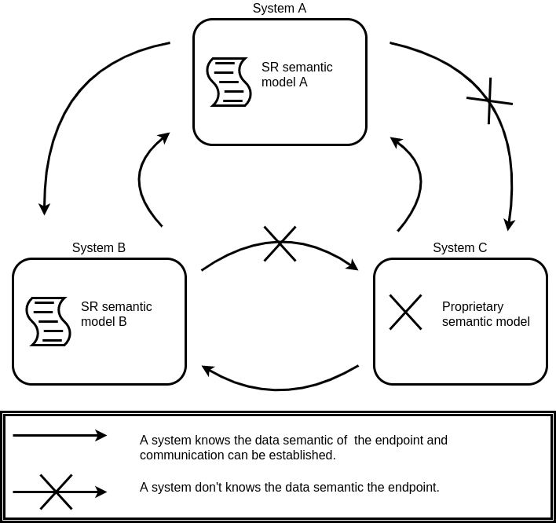
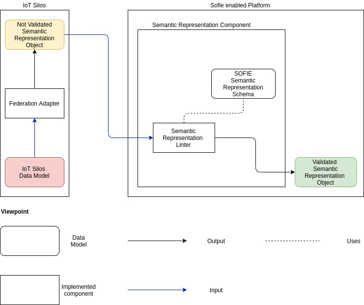
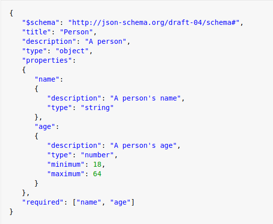
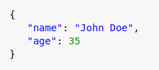
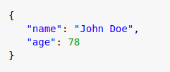
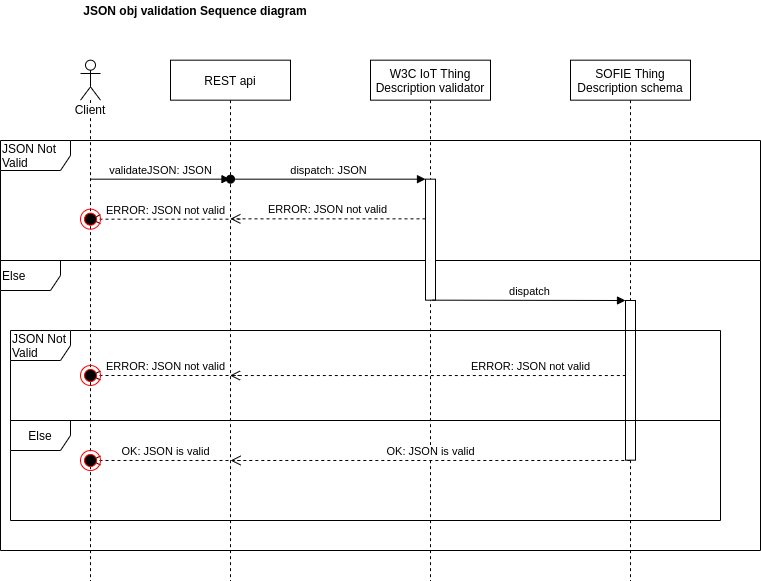

# SOFIE Semantic Representation component

**Table of contents:**

- [Description](##description)
  - [Relation with SOFIE](#relation-with-sofie)
- [Architecture Overview](#architecture-overview)
  - [Object Flow View](#Object-flow-view)
  - [Object Example](#objects-example)
  - [Sequence Diagram](#sequence-diagram)
  - [Main Decisions](#main-decisions)
  - [Key Technologies](#key-technologies)

- [Usage](#usage)
  - [Prerequisites](#prerequisites)
  - [Build and Execution](#build-and-execution)
    - [Schema configuration](#schema-configuration)
    - [Message Validation](#message-validation)
  - [API](#api)

- [Testing](#testing)
  - [Running the tests](#running-the-tests)
  - [Remove the component](#remove-the-component)
  - [Evaluating the results](#evaluating-the-results)

- [Contact Info](#contact-info)
- [License](#License)

## Description

Exchanging data between different IoT platforms and systems can be challenging as the platforms often utilise different 
formats for their data representation and definition, and one system may not know which data model the other system can handle. 
The SOFIE Semantic Representation (SR) component mitigates this problem and restores semantic interoperability between 
systems and IoT platforms by allowing the definition and management of the semantics of the data. 
The semantic representation component typically offers two functionalities:
- Data semantic definition
- Data validation

As shown in the figure 1, systems implementing the SR enable interoperability by defining a data semantic which
can be used by other entities to exchange data. The interoperability is achieved with a data model,
which can be defined using different data representation standards, such as JSON schemas, W3C WoT Thing Description, 
but proprietary models can also be implemented when required by the application. 
This data model is then managed by the SR component, which allows users to define the accepted data models in the system. 
An example could be the definition of security rules in the schema stored in the SR component: 
defining the security rules enforces third parties’ schema implementations to satisfy them if they want to communicate with the system. 
Another example is the definition of a schema which defines the main properties and interfaces of the IoT devices that can interact with the system. 

Figure 1 : Semantic Representation system interoperability 



### Architecture Overview

This chapter shows different views to explain the component architecture.

#### Object Flow View

Figure 2: Object flow view



Table 1: Component description

| Name                   | Description                                                                                                                                                                                                                                                                 |
|------------------------|-----------------------------------------------------------------------------------------------------------------------------------------------------------------------------------------------------------------------------------------------------------------------------|
| IoT Silos              | This element represents an external stakeholder’s composition of IoT devices. They offer functionalities to external users and can be considered like a siloed platform which wants to join a SOFIE enabled platform                                                        |
| SOFIE enabled platform | This is can be considered like a project which is built with the SOFIE framework                                                                                                                                                                                            |
| IoT Silos Data Model   | The data model of the IoT Silos. The SOFIE enabled platform cannot understand this data model                                                                                                                                                                               |
| Federation adapter     | The element is optional, but it translates the IoT silos Data Model into an object which can be used by a SOFIE enabled platform                                                                                                                                            |
| Not Validated SR obj   | This object can be the output of the Federation Adapter or it can be created in any way by the IoT silos owner. It describes the data of the IoT Silos in a structure understandable by the SOFIE enabled platform.                                                         |
| SR component           | This component takes in input an object and return an object which is compliant with the SOFIE enabled platform semantic rules                                                                                                                                              |
| SR Thing Description   | This is the schema supported by the SOFIE enabled platform. Each platform implementation has a different schema, it should be sent to the SR Component as a parameter and can be updated during the SR Component lifetime. It is used to validate the object from IoT Silos |
| SR linter              | This is a sub-component of the Semantic Representation. It validates the object in input with the schema found in the SR Thing Description. If everything is good, it returns a validated object                                                                            |
| Validated SR obj       | The result of the SR linter. Is an object which contains the data of the IoT silos in a structure understandable by the SOFIE enabled platform and its components                                                                                                           |

#### Objects Example

The Figure 3 shows an example for Thing Description where it is defined the acceptable information for the name and the age.
The image then shows two JSON message, the one on the left is valid because it is concordant with the Thing Description rules. 
The message on the right instead is not valid and therefore will be rejected.

Figure 3: JSON message examples

| Thing description                                  |
|----------------------------------------------------|
|  |

| Valid SR object                          | Not valid SR object                         |
|------------------------------------------|---------------------------------------------|
|  |  |

#### Sequence diagram
The following sequence diagram shows the main steps occuring when a system which uses SR validates a message 

Figure 4: Semantic Representation validation process



#### Main Decisions

| Decision         | Technology   | Description                                    |
|------------------|------------  |------------------------------------------------|
| Docker image os  | Ubuntu 18.04 | Easy to handle with the chosen Data schema     |
| API              | Rest         | A lightweight and widely used API architecture |
| Data schema      | W3C WoT-TD   | Dependent on SR component requirements         |
| Data input       | JSON         | Easy to handle with the chosen Data schema     |

#### Key Technologies

The software modules are implemented in **Python** and the component uses the **Flask** framework to enable networking 
functionalities. Messages and data validation is performed using **JSON schema validator**.

### Relation with SOFIE

The Semantic Representation component is standalone, it may be used by other SOFIE components and applications if necessary.
SOFIE pilots use the Semantic Representation component for different purposes.

[Context-aware Mobile Gaming](https://media.voog.com/0000/0042/0957/files/sofie-onepager-gaming-noScreens.pdf) utilises 
 the component to assure that external beacons confirms to the correct licensing, before being added to the system. 

## Usage

The component can be used as a dockerized service or run as python app. 

### Prerequisites
The prerequisites to use this component are the following:
- Docker

as python app:
- Make
- Python3
- Pip3

### Build and Execution
This chapter shows the steps to run the component as docker service in a linux machine.
While in the component folder, use the following commands:
```
make setup
```
To run the component:
```
make run
```

by default the component runs on the internal port ``5000`` to external port ``5000``.
To modify the port change the variable ``PORT`` in the Makefile.

#### Schema configuration

The component can handle JSON schemas, the user is free to create and use every 
[JSON schema](https://json-schema.org/), the component has been tested using 
[W3C WoT ThingDescription](https://www.w3.org/TR/wot-thing-description/). Please, use those resources to learn how to create a schema.


Once the JSON schema has been defined, the user can add it to the component as in below example:
````
url = 0.0.0.0:5000/api/schema
schema = 'your_schema'
request.post(url, json=schema)
````

#### Message validation

To validate any message against a schema, the latter must be configured as in the previous step.
To validate the message you need the message and the id of the schema the user intend to validate the message against.
````
url = 0.0.0.0:5000/validate
example_msg = 'your_json_msg'
example_schema_id ='schema_id'
request.post(url, json='message': example_msg, 'schema_name': example_schema_id})
````
### API
The full OpenApi are available on [Swaggerhub](https://app.swaggerhub.com/apis/filippovimini/semantic-representation_open_api/1.0.0)
## Testing

The component define a series of functional api tests.
These tests check that from a defined input, the output are consistently correct.

### Running the tests

To test the component, in cmd navigate in the component folder, then:
```
make test
```

### Remove the component 
To test the component, in cmd navigate in the component folder, then:
```
make clean
```

### Evaluating the results

The user can evaluate the status of the component by running the tests. If all of them are positive then the component 
should run as intended.

## Open issue
The component, in the current state there is no major bug or missing functionality.

## Future Work
The component satisfy SOFIE project requirements and there is no plan to extend functionalities.

## Release Note

**2020-09-17**

**Added**

- Updated API design and performance upgrade

**2020-08-07**

**Added**

- Main validation functionalities 

## Contact Info

filippo.vimini@aalto.fi

## License

This component is licensed under the Apache License 2.0.
